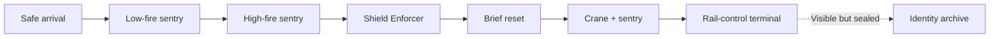

## Purpose

> **Accepted** — The first representative encounter takes place in an industrial freight terminal. It should prove the shared action fundamentals before production begins on moving-train spectacle, bosses, broad progression, or a complete death cycle.

The encounter should take approximately three to five minutes on a successful first pass and remain small enough to rebuild when playtesting invalidates an assumption.

## Mission context

> **In progress** — The crew is ordered to restart a cargo line carrying a reactor component needed by a nearby settlement. Restoring the terminal creates a genuine local benefit while secretly reconnecting the controller to a sealed identity archive.

This premise demonstrates the accepted rule that missions can be locally beneficial and collectively dangerous.

## Progressive topology

> **Accepted** — The first playable pass is a flat, single-path route from entrance to rail-control system. It validates movement, shooting, evasion, threat order, pacing, and objective feedback without exploration complexity.

The encounter evolves only after that baseline works:

1. **Baseline pass:** one streamlined route and three threat types.
2. **Route pass:** add one compact upper/lower fork that rejoins before the objective.
3. **Memory pass:** expose a sealed archive and let one Memory Imprint open a maintenance route into it.

Do not build the fork or sealed route before the baseline pass is satisfying. This progression lets each added layer validate a specific pillar instead of making the first test diagnose movement, combat, exploration, and progression simultaneously.

> **Accepted** — The flat baseline follows this sequence:

Fork and Memory-route overlays should be added only after their respective validation passes exist.

## Baseline threat sequence

> **Accepted** — Introduce only three layers of pressure, one at a time:

1. **Horizontal sentry alone:** clearly telegraphed low and high firing lanes test eight-direction continuous rifle fire with unlimited ammunition while moving, optional grounded aim-locking, jumping over low shots, and sliding beneath high shots.
2. **Shield Enforcer alone:** steadily advances behind frontal armour that completely blocks baseline rifle fire. A telegraphed, committed charge forces the player to jump over, reverse direction, and shoot the exposed rear during recovery.
3. **Combined pressure:** one ranged sentry plus one timed freight hazard tests reading multiple signals and choosing when to advance.

The sentry uses a deterministic sequence. Barrel pose, warning animation, and sound—not colour alone—distinguish low from high fire. The first placement teaches low fire, the second teaches high fire, and the final placement may use a fixed low–high sequence.

Blocked rifle rounds must ricochet with clear visual and audio feedback while dealing no damage or stagger. The Enforcer cannot turn during its charge and pauses after missing.

The sequence must teach each demand before combining them. Vertical, diagonal, and full eight-direction enemies belong to later encounters, not the flat baseline.

> **Accepted** — The timed freight hazard is an overhead crane that periodically lowers a cargo container into the traversal lane. A warning beacon and floor shadow telegraph the descent. The lowered container blocks movement and enemy fire; raising it opens the route and restores the sentry's line of sight.

The player can wait, attack from temporary cover, or cross during the opening. Being beneath the descending container causes damage.

## Flat-baseline sequence

> **Accepted** — Build the baseline in this order:

1. **Safe arrival:** a short space tests running, variable-height jumping, and aiming without damage pressure.
2. **Low-fire sentry:** teaches jumping over a horizontal projectile.
3. **High-fire sentry:** teaches combat sliding beneath a horizontal projectile.
4. **Shield Enforcer:** provides enough space to jump over its charge, reverse direction, and attack its exposed rear.
5. **Brief reset:** a safe space reveals the rail-control objective ahead.
6. **Crane and sentry:** the cycling container alternately blocks the lane and enemy fire while the sentry uses a deterministic low–high pattern.
7. **Rail-control terminal:** clear activation feedback completes the mission; the sealed identity archive remains visible but inaccessible.

Each beat teaches or combines one demand. Do not add optional enemies, collectibles, dialogue, or route complexity to the baseline pass.

## Camera

> **Accepted** — Use smooth side-follow with dead zones and gradual movement-based look-ahead. Aiming alone does not shift framing. The camera supports backward repositioning, stays inside level bounds, and never force-scrolls during this encounter.

> **Needs evidence** — Tune camera values in the blockout rather than fixing numerical values in documentation.

## Health and restart

> **Accepted** — The Rifle Marine begins with a provisional five-segment integrity bar. Standard threats remove one segment, while the descending cargo container may remove two. Damage gives a brief hit reaction and short post-hit invulnerability.

Reaching zero integrity restarts the flat encounter from its entrance. This baseline restart is a test rule, not the final campaign death cycle.

## Validation passes

### Rifle Marine

> **Needs example** — Prove that one-speed digital running, variable-height jumping, moderate air control, eight-direction twin-stick firing, optional grounded aim-locking, combat sliding, and route reading feel satisfying with the balanced baseline character. Include at least one high projectile or low obstacle that makes sliding a deliberate choice without requiring it everywhere.

### Contrasting character

> **Needs example** — Replay the same geometry with one contrasting character and demonstrate materially different observations, decisions, and execution.

### Memory Imprint

> **Needs example** — Add one Memory Imprint that reveals why the terminal archive matters and grants an interaction, technique, tactical understanding, or route permission that exposes a new approach.

## Explicit exclusions

- No boss.
- No moving-train sequence.
- No large enemy roster.
- No complete upgrade economy.
- No elaborate death-and-recovery implementation.
- No production-scale narrative sequence.

These belong later only if the encounter validates the foundation.

## Starting art library

> **Accepted** — Use the [CraftPix Cyberpunk Platformer collection](https://craftpix.net/sets/cyberpunk-platformer-asset-pixel-art/) as the starting visual and production scaffold. Assets may be selected, recoloured, recomposed, modified, replaced, or supplemented according to the accepted art direction.

The collection is a means of testing the game, not authority over its fiction, mechanics, location catalogue, or final visual identity.

> **Needs image** — Create an encounter mood board or blockout screenshot from legally acquired assets once the private source-asset workflow is established.

> **Accepted** — Licensed originals and modified derivatives stay under `examples/demo/game/assets.private/craftpix/`, which is ignored by Git.

> **TODO** — Record the exact packs, license tier, acquisition date, purchase evidence, and source archive provenance inside that private workflow before integrating assets.

## Completion criteria

The encounter is validated only when:

1. the Rifle Marine is satisfying without special progression;
2. threats produce readable decisions rather than visual noise;
3. a player can explain what hurt them, what they learned, and what they would try next;
4. the later lower and upper routes create different tactical value;
5. another character materially transforms the encounter;
6. one Memory Imprint changes both understanding and action.
