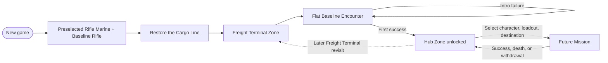

This graph represents campaign progression, not physical geography.

## Current graph

## Opening path

1. Start a new game with no Hub or loadout menu.
2. Deploy immediately as the [[Characters/Rifle Marine|Rifle Marine]] with the [[Equipment/Baseline Rifle|Baseline Rifle]].
3. Receive [[Missions/Restore the Cargo Line|Restore the Cargo Line]] as a preselected introduction Mission.
4. Enter the [[World/Freight Terminal|Freight Terminal]] and complete the [[Gameplay/Representative Encounter|flat baseline encounter]].
5. Restart inside the introduction on failure; the Hub is not available yet.
6. Reach the [[World/Hub|Hub]] for the first time after Mission success.

## Standard post-introduction path

1. Select the Rifle Marine or the immediately available contrasting character, plus a loadout, at the Hub.
2. Choose an available Mission and destination.
3. Deploy into its Zone.
4. Return to the Hub after success, death, or voluntary withdrawal.

## Accepted persistence

- World discoveries, shortcuts, and unlocked routes belong to the shared campaign.
- Equipment and ordinary inventory belong to the shared crew stash.
- Item upgrades remain attached to the item.
- Innate abilities and character mastery remain character-owned.
- Changing character does not create another world state.

## Unknown progression

> **Open question** — Which destination unlocks after the Freight Terminal, and whether success, a Memory Imprint, or another condition exposes it.

> **Open question** — Whether later Zones are selected directly from the Hub, connected physically, or use a limited hybrid.

Do not extend the diagram until another Zone or progression relationship is accepted.
